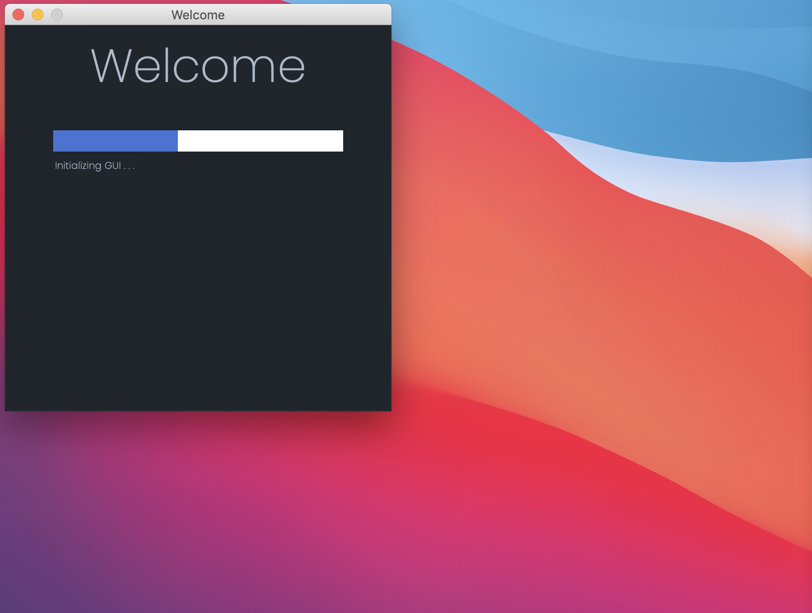
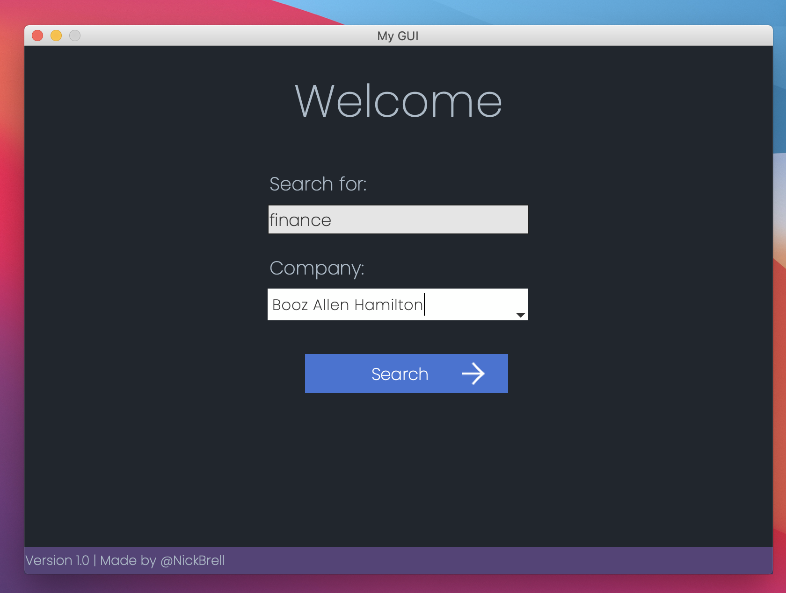
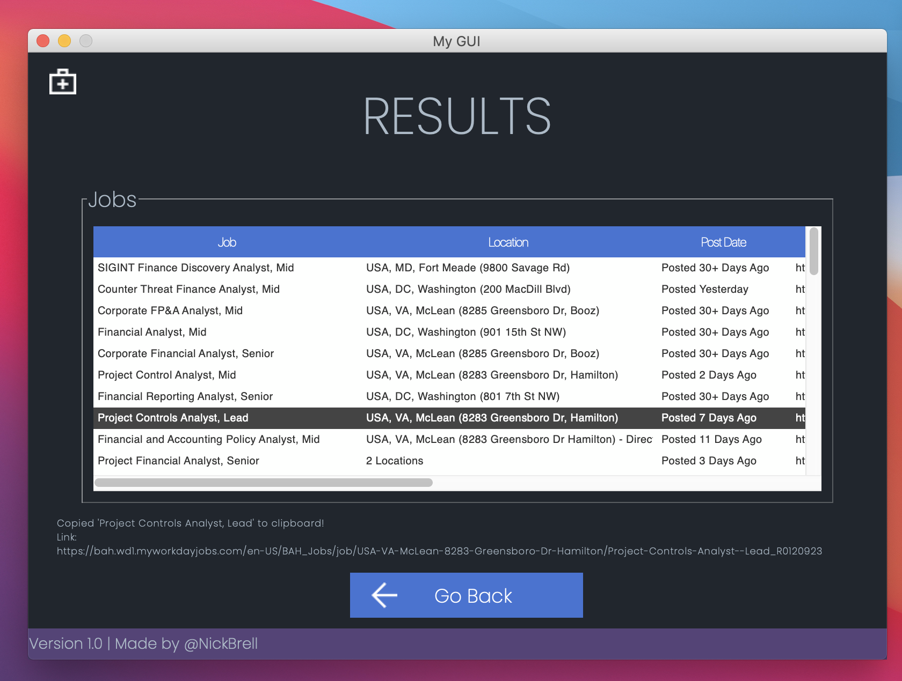

# Workday Job Web Scraper GUI (Custom Theme)

## Description
 - This is an application I created that scrapes for job postings on WorkDay websites. I created a web scraping script ([`jobsSearch_dataFrame.py`](https://github.com/nickb210/Workday-Job-Web-Scraper-GUI-Custom-Theme-/blob/master/jobsSearch_dataFrame.py)) which uses [Selenium](https://selenium-python.readthedocs.io/) to automate a job search based on user input. I also created a link generator ([`workday_linkgen.py`](https://github.com/nickb210/Workday-Job-Web-Scraper-GUI-Custom-Theme-/blob/master/workday_linkgen.py)) so the link for each job posting can be returned to the user. When using this application the following fields are returned to the user for each job posting:
    - Job Title
    - Job Location
    - Job Posting Date
    - Link to job posting

## Instructions
IMPORTANT: You need to have the correct chromedriver version based on the version of Google chrome installed on your machine. You can dowload the correct verision [here](https://chromedriver.chromium.org/downloads). After you download the driver place it in [`selenium`](https://github.com/nickb210/Workday-Job-Web-Scraper-GUI-Custom-Theme-/tree/master/selenium) directory. 
```
1. pip3 install -r requirements.txt
2. python3 app.py
```


---
## Demo
---
#### Splash Screen


#### Search Page


#### Results Page
